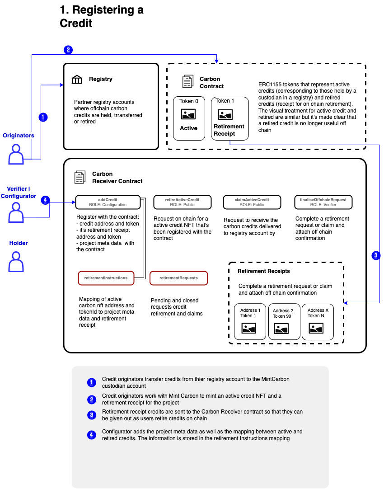
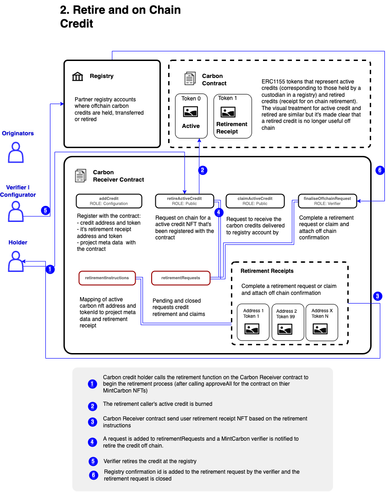
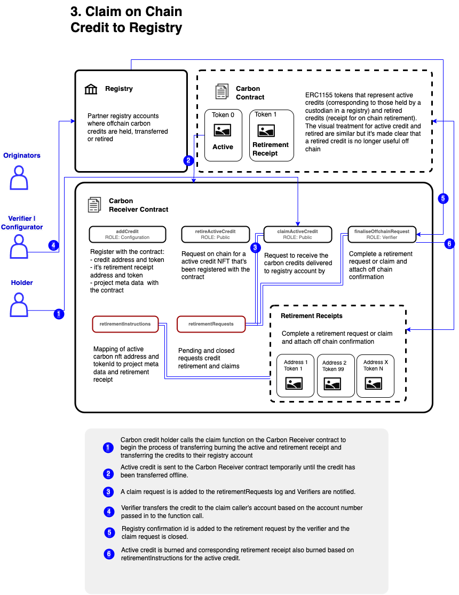

# Tokenized Carbon Credit Workflows

A product architecture case study from work on First Carbon / MintCarbon.

These diagrams explore how carbon credits could be registered, represented on-chain, retired, and reconciled with off-chain registry records.

The core product challenge was not simply “put carbon credits on-chain.” It was designing a workflow that respected the existing registry system, preserved auditability, supported retirement receipts, and made the user experience understandable.

## Why this mattered

Carbon credits are real-world assets that already exist inside registry, custody, verification, and audit systems. Any useful tokenized version needs to account for that reality.

The design challenge was to connect on-chain representations with off-chain records in a way that could support:

- Registry-held credits
- Active credit tokens
- Retirement receipts
- Off-chain confirmations
- Verifier workflows
- Holder claims
- Auditability and user trust

## Workflows

### 1. Registering Credits

This flow shows how credits held in a registry account could be connected to on-chain token representations.

### 2. Retiring an On-Chain Credit

This flow shows how a holder could retire an active credit and receive a retirement receipt while preserving off-chain registry confirmation.

### 3. Claiming an On-Chain Credit to Registry

This flow shows how an on-chain credit representation could be claimed back toward registry custody.

## Product themes

- Tokenized real-world assets
- On-chain / off-chain reconciliation
- Registry-integrated workflows
- Retirement receipts and audit trails
- Product design in regulated or trust-sensitive markets
- Securities-law / regulatory analysis in collaboration with counsel
- User experience for complex financial and environmental assets

## My role

I worked across product strategy, tokenized asset design, workflow architecture, and securities-law / regulatory questions in collaboration with external counsel.

This work sat at the intersection of product, finance, blockchain infrastructure, legal reasoning, and user trust.

## Notes

This is a product architecture case study, not a live protocol or implementation repo. The purpose is to show the thinking behind tokenized real-world asset workflows: how off-chain assets, registry systems, on-chain representations, and user-facing product design can fit together.
